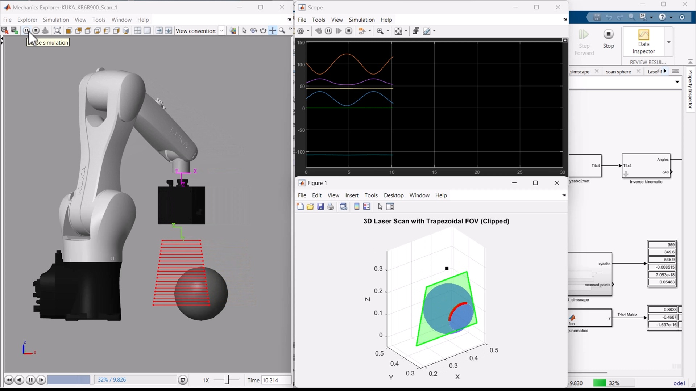

## KUKA-KR5-R900-MATLAB-Simulink
#### Simulink basic simulation of the KUKA KR5 R900 sixx robot

# KUKA-KR5-R900-Laser-Scanner-Simulation

### 🦾 Simulink simulation of KUKA KR5 R900 with mounted 2D laser profilometer scanning a sphere

This repository extends the basic KUKA KR5 R900 simulation by adding a **2D laser scanner** (profilometer) mounted at the robot's **TCP** (Tool Center Point). The scanner performs a **surface scan of a sphere**, simulating real-time laser profile data using **MATLAB Simulink + Simscape Multibody**.

## 📌 Features

- ✅ Real-time simulation of KUKA KR5 R900 using Simscape Multibody  
- ✅ 2D laser scanner simulation mounted on the TCP  
- ✅ Sphere scanning scenario with adjustable scan frequency  
- ✅ Analytical 6DOF inverse kinematics solution  
- ✅ Dynamic visualization of scanning motion and laser intersections  
- ✅ Educational tool for learning about robotics, sensor integration, and scanning

> 🎥 **Watch on YouTube**: [Demo Video](https://youtu.be/5C7uFYExv2Q?si=nYtZtlngcmz0QnzO)

## 🚀 Getting Started

1. Open the project in **MATLAB R2024a** or newer (Simulink + Simscape Multibody required)
2. Load the `KUKA_KR6R900_Scan_1.slx`
3. Run the simulation and visualize scanning motion
4. Adjust scanning frequency in the model workspace for custom behavior

## 👨‍🔬 Applications

- Educational demonstrations of laser scanning  
- Simulating robotic sensor data  
- Testing kinematic models with sensor payloads  
- Research in automation, 3D profiling, and digital twin development

## 🧩 Related Projects

- [KUKA-KR5-R900-MATLAB-Simulink](https://github.com/hexakinetica/KUKA-KR5-R900-MATLAB-Simulink) – Base robot simulation  
- More robotics content on our [YouTube channel](https://www.youtube.com/@hexakinetica)

### Contributing

We welcome contributions from the community! If you'd like to improve the models or add new functionality, please submit a pull request.

### Contact

Email: contact@hexakinetica.com
Website: https://www.hexakinetica.com

### Disclaimer

These models are not official KUKA models and are not affiliated with, endorsed by, or approved by KUKA Robotics. All trademarks, product names, and company names mentioned are the property of their respective owners.
The models are provided for visualization and educational purposes only and are not intended for manufacturing, engineering, or commercial use. The authors and distributors provide these models "as is" without any guarantee of accuracy, completeness, or fitness for any particular purpose.
If you are the copyright holder or believe any material posted violates your rights, please contact us to request removal.

### License
This project is licensed under the MIT License.
You are free to:
Use, copy, modify, merge, publish, distribute, sublicense, and sell copies of the software
Under the following terms:
The above copyright notice and this permission notice shall be included in all copies or substantial portions of the Software.
The software is provided "as is", without warranty of any kind, express or implied.
For more information, see the full license text: https://opensource.org/licenses/MIT